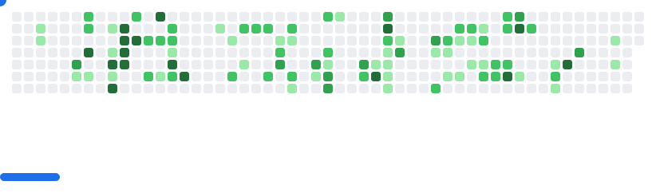

## Gjergj Brestovci

Hi, I’m @GjergjBrestovci

- 👀 I’m interested in Quantum Mechanics, Machine Learning, and Web Development
- 🌱 I’m currently learning Python, TypeScript, MySQL, Calculus, Rust
- 💞️ I’m looking to collaborate on just about everything
- 📫 Reach me: gjergj.brestovci@gmail.com
- ⚡ Fun fact: quantum mechanics is brain cancer 🫩

<picture>
  <source media="(prefers-color-scheme: dark)" srcset="images/breakout-dark.svg" />
  <source media="(prefers-color-scheme: light)" srcset="images/breakout-light.svg" />
  
</picture>

This profile repo uses the [github-breakout](https://github.com/cyprieng/github-breakout) GitHub Action to generate an SVG Breakout game from my contribution graph every day.

The workflow file is located at `.github/workflows/generate-breakout.yml`.

<!---
GjergjBrestovci/GjergjBrestovci is a ✨ special ✨ repository because its `README.md` (this file) appears on your GitHub profile.
You can click the Preview link to take a look at your changes.
-->
