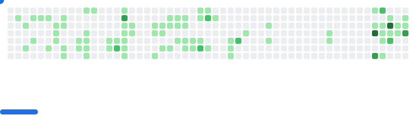

# Gjergj Brestovci

Full-stack developer based in Vienna. I build web apps and AI/ML tooling,
with a focus on TypeScript, React, Node.js, and Python.

## Stack

| Area        | Technologies                              |
|-------------|-------------------------------------------|
| Frontend    | React, Next.js, TypeScript, Tailwind CSS  |
| Backend     | Node.js, Express.js, REST APIs            |
| AI / ML     | PyTorch, HuggingFace, seq2seq models      |
| Languages   | TypeScript, Python, Java, JavaScript      |
| Tools       | Git, Linux, Docker                        |

## Projects

- **[Skylit.at](https://skylit.at)** — A startup building EU compliance software as well as quality of life features such as reorder forecasting and accounting compliance. Created by Gjergj Brestovci in collaboration with Jonathan Löscher and Fabian Gorski.

- **[Albanian translator](https://github.com/GjergjBrestovci/Translator)** — Seq2seq Albanian-to-English translation model built with
  PyTorch and HuggingFace. One of very few open efforts in this language pair.
- **[elitaere-ausgabe.at](https://elitaere-ausgabe.at)** — A social media type newspaper site for students at HTL Spengergasse, currently only for 3EHIF, in the future for the entire school.
- **[chen-software](https://github.com/GjergjBrestovci/chen-software)** — A quality of life software created for data modeling classes. Students can now easily create chen diagrams, and export them in PDF format for easy assignment completion. 
## Contact

📧 gjergj.brestovci@gmail.com

<picture>
  <source media="(prefers-color-scheme: dark)" srcset="images/breakout-dark.svg" />
  <source media="(prefers-color-scheme: light)" srcset="images/breakout-light.svg" />
  
</picture>

This profile repo uses the [github-breakout](https://github.com/cyprieng/github-breakout) GitHub Action to generate an SVG Breakout game from my contribution graph every day.

The workflow file is located at `.github/workflows/generate-breakout.yml`.

<!---
GjergjBrestovci/GjergjBrestovci is a ✨ special ✨ repository because its `README.md` (this file) appears on your GitHub profile.
You can click the Preview link to take a look at your changes.
-->
